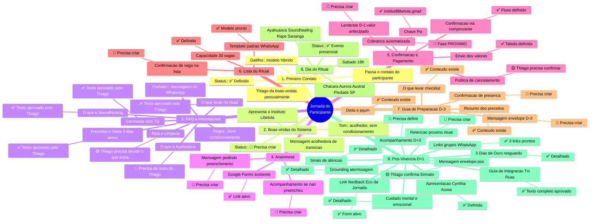
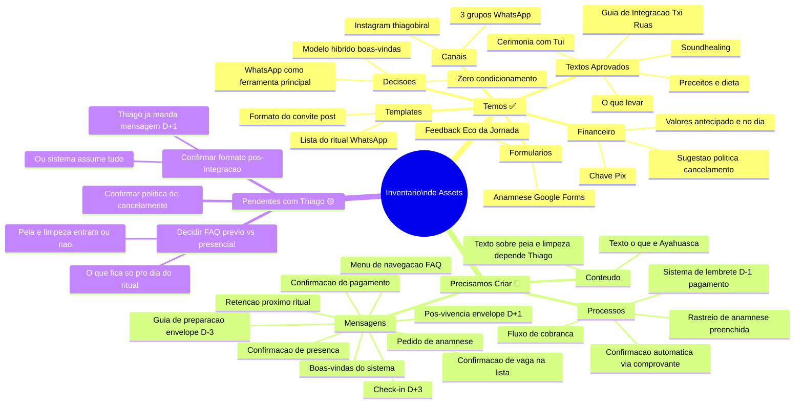
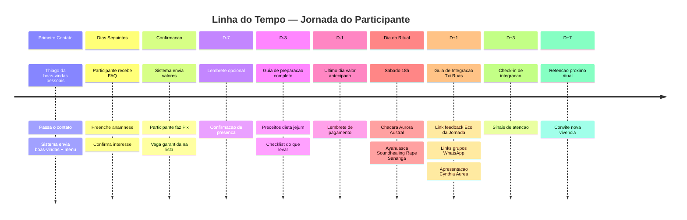
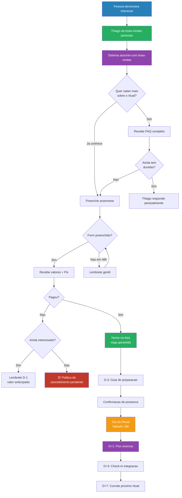

# Jornada do Participante — Instituto Libelula

> Mapa mental da jornada completa: do primeiro contato a pos-vivencia.
> Legenda de status: `✅ Temos` / `🟡 Pendente com Thiago` / `🔴 Precisa criar` / `📍 Gatilho temporal`

---

## Mapa Mental Geral

---

## Fluxo Sequencial Detalhado

```mermaid
flowchart LR
    subgraph ETAPA1["1. PRIMEIRO CONTATO"]
        A1["Thiago da boas-vindas"] --> A2["Passa contato do participante"]
    end

    subgraph ETAPA2["2. SISTEMA ASSUME"]
        B1["🔴 Mensagem de boas-vindas\nacolhedora + transicao"]
        B2["🔴 Apresentacao do Instituto\nproposito + como funciona"]
        B3["🔴 Menu de opcoes:\nFAQ / Anamnese / Valores"]
    end

    subgraph ETAPA3["3. FAQ E INFORMACOES"]
        C1["✅ O que e Soundhealing"]
        C2["✅ O que levar"]
        C3["✅ Preceitos e dieta"]
        C4["✅ Cerimonia com Tui"]
        C5["🔴 O que e Ayahuasca"]
        C6["🟡 Peia e limpeza\nThiago decidindo"]
    end

    subgraph ETAPA4["4. ANAMNESE"]
        D1["🔴 Mensagem pedindo\npreenchimento"]
        D2["✅ Google Forms\nforms.gle/G1FQ..."]
        D3["🔴 Lembrete se nao\npreencheu em 48h"]
    end

    subgraph ETAPA5["5. CONFIRMACAO + PAGAMENTO"]
        E1["✅ Valores: R$180 antecipado\nR$210 no dia"]
        E2["✅ Chave Pix:\ninstitut8libelula@gmail.com"]
        E3["🔴 Confirmacao via\ncomprovante"]
        E4["📍 D-1: Lembrete\nvalor antecipado acaba"]
        E5["🟡 Politica de cancelamento\naguardando confirmacao"]
    end

    subgraph ETAPA6["6. LISTA DO RITUAL"]
        F1["✅ Template padrao\n30 vagas"]
        F2["🔴 Confirmacao de\nvaga garantida"]
    end

    subgraph ETAPA7["7. PREPARACAO"]
        G1["📍 D-3: Guia de\npreparacao completo"]
        G2["✅ Preceitos dieta jejum"]
        G3["✅ Checklist o que levar"]
        G4["🔴 Confirmacao de\npresenca final"]
    end

    subgraph ETAPA8["8. DIA DO RITUAL"]
        H1["📍 Sabado 18h\nChacara Aurora Austral"]
    end

    subgraph ETAPA9["9. POS-VIVENCIA"]
        I1["📍 D+1: Guia Txi Ruas\n3 Dias de Ouro"]
        I2["📍 D+1: Link feedback\nEco da Jornada"]
        I3["📍 D+1: Grupos WhatsApp\nComunidade + Astrologia"]
        I4["📍 D+1: Apresentacao\nCynthia Aurea"]
        I5["📍 D+3: Check-in\ncomo esta a integracao"]
        I6["🔴 Mensagem de retencao\nproximo ritual"]
    end

    ETAPA1 -->|"Thiago passa\no bastante"| ETAPA2
    ETAPA2 -->|"Participante quer\nsaber mais"| ETAPA3
    ETAPA3 -->|"Participante\ninteressado"| ETAPA4
    ETAPA4 -->|"Form preenchido"| ETAPA5
    ETAPA5 -->|"Pagamento\nconfirmado"| ETAPA6
    ETAPA6 -->|"📍 D-3\nautomacao"| ETAPA7
    ETAPA7 -->|"📍 Dia do ritual"| ETAPA8
    ETAPA8 -->|"📍 D+1\nautomacao"| ETAPA9

    style ETAPA1 fill:#4a9e4a,color:#fff
    style ETAPA2 fill:#c0392b,color:#fff
    style ETAPA3 fill:#e67e22,color:#fff
    style ETAPA4 fill:#e67e22,color:#fff
    style ETAPA5 fill:#e67e22,color:#fff
    style ETAPA6 fill:#e67e22,color:#fff
    style ETAPA7 fill:#e67e22,color:#fff
    style ETAPA8 fill:#4a9e4a,color:#fff
    style ETAPA9 fill:#e67e22,color:#fff
```

---

## Inventario: O Que Temos vs O Que Precisamos

---

## Linha do Tempo com Gatilhos

---

## Mapa de Decisoes do Participante

---

## Observacoes

- **Tudo via WhatsApp** — Thiago opera sozinho, a ferramenta precisa ser simples
- **Tom de voz** — acolhedor, direto, poético quando apropriado, zero condicionamento
- **Modelo hibrido** — Thiago faz o primeiro contato humano, sistema assume o resto
- **Ecossistema completo** — ritual → integracao Txi Ruas → astrologia Cynthia → comunidade grupos
- **Proximo ritual conhecido** — O Chamado da Rainha, 25/04/2026, Touro

### Links Uteis
- Anamnese: https://forms.gle/G1FQhZ51DfF63MFJ7
- Feedback: https://forms.gle/8dRAgiW6iutK8RmX8
- Comunidade: https://chat.whatsapp.com/Gj2zfOnYLNM2oyrvEzvWCI
- Astrologia: https://chat.whatsapp.com/LVNliIDq33C0tEAvtItQy5
- Instagram: https://www.instagram.com/thiagobiral/
